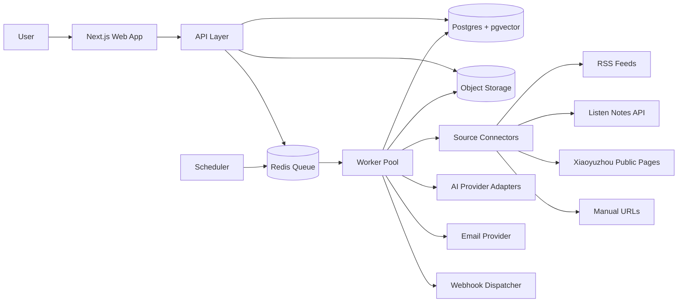
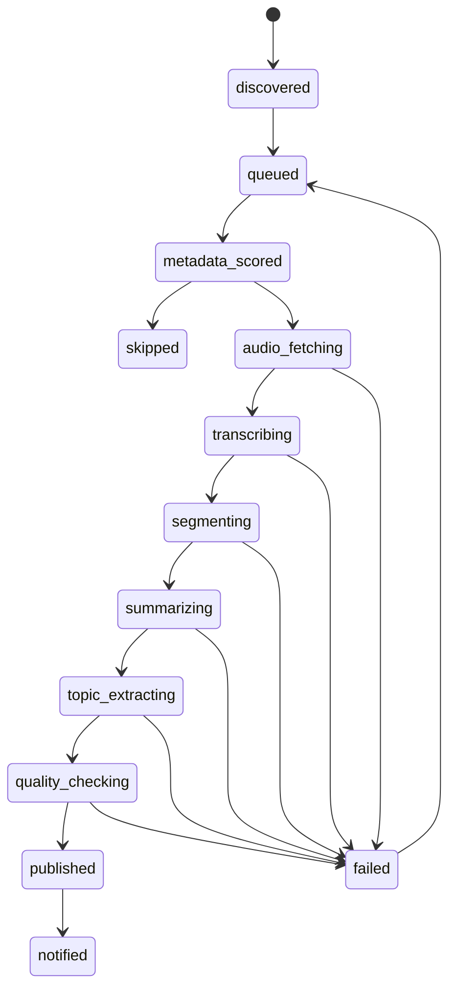
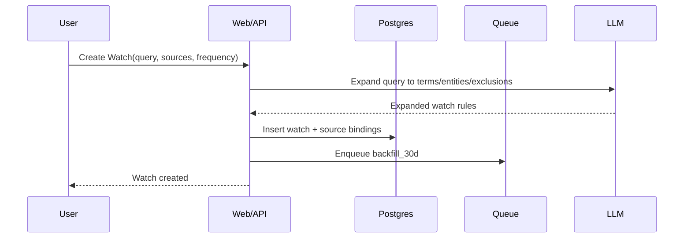
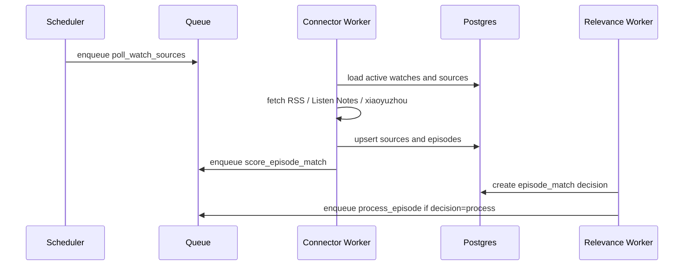

# 播客情报平台技术设计与实施文档

创建日期：2026-04-24

关联 PRD：[podcast-intelligence-prd.md](./podcast-intelligence-prd.md)

## 1. 技术目标

本系统要支持用户配置 Watch 后，自动发现相关播客内容，完成转录、分段、证据型 insight 抽取，并通过 Web App、邮件和 webhook 推送结果。

MVP 的技术目标：

- 支持中英双语播客处理。
- 支持 RSS / Listen Notes / 手动 URL / 小宇宙公开链接 best-effort connector。
- 支持指定播客更新监听和主题搜索发现。
- 支持 Watch 创建后最近 30 天回溯。
- 支持完整转录内部保存，但默认不展示全文。
- 每条核心 insight 必须绑定 episode、时间戳、转录证据片段和置信度。
- 支持 Web App + 邮件简报，预留 Slack / 飞书 / webhook。
- 首版面向个人 Pro，但数据模型从第一天按 workspace/team 设计。

## 2. 推荐技术栈

### 2.1 应用层

推荐首版使用 TypeScript 单语言栈，降低上下文切换和团队复杂度。

| 层级 | 推荐方案 | 理由 |
| --- | --- | --- |
| Web App | Next.js App Router | 快速实现配置、详情页、inbox、登录和服务端渲染 |
| API | Next.js Route Handlers 或独立 Hono/Fastify service | MVP 可同仓库开发，后续可拆服务 |
| Worker | Node.js + BullMQ | 适合队列式音频处理、LLM 任务、重试和任务状态追踪 |
| Scheduler | pg_cron / Trigger.dev / Cloud Scheduler + worker endpoint | 周期抓取 RSS、主题搜索、日报生成 |
| Database | Postgres | 核心业务数据、任务状态、workspace 权限 |
| Vector Search | pgvector | MVP 避免额外向量数据库，足够支持语义检索和去重 |
| Queue / Cache | Redis | BullMQ 队列、去重锁、rate limit |
| Object Storage | S3 / Cloudflare R2 | 存音频缓存、转录 JSON、导出文件 |
| Email | Resend / Postmark | 简报、登录邮件、处理完成通知 |
| Auth | Auth.js / Clerk | MVP 可快速接入，需支持 workspace 扩展 |
| Payments | Stripe | 个人 Pro + credits 超额计费 |
| Observability | Sentry + OpenTelemetry + Postgres job logs | 定位 connector、转录和 LLM 失败 |

### 2.2 AI provider 抽象

所有模型调用必须走 provider adapter，避免绑定单一供应商。

| 能力 | MVP 推荐 | 备选 |
| --- | --- | --- |
| 转录 | OpenAI transcription API 或 Deepgram | AssemblyAI、Whisper self-host |
| 轻量相关性判断 | 小模型 structured output | embedding + keyword hybrid |
| 摘要/insight 抽取 | 支持 JSON schema 的高质量 LLM | Claude、OpenAI、Gemini |
| Embedding | 成本低、跨语言效果稳定的 embedding model | 本地 embedding |

provider adapter 需要统一输出：

```ts
type TranscriptSegment = {
  startSec: number;
  endSec: number;
  text: string;
  speaker?: string;
  confidence?: number;
};

type LlmJsonResult<T> = {
  data: T;
  model: string;
  inputTokens?: number;
  outputTokens?: number;
  costUsd?: number;
  latencyMs: number;
  rawProviderResponseId?: string;
};
```

## 3. 系统架构

### 3.1 高层架构



### 3.2 服务边界

MVP 可用一个 monorepo 部署三个 runtime：

- `web`: Next.js Web App + API routes。
- `worker`: 长任务 worker，处理抓取、转录、摘要、简报、webhook。
- `scheduler`: 定时触发器，可先用外部 cron 调用 API，也可作为 worker 内进程。

后续拆分标准：

- 当转录/LLM 任务影响 Web 响应时，worker 独立部署。
- 当 connector 数量变多且失败率差异大时，connector worker 单独队列。
- 当 B2B webhook/API 增长时，integration service 独立限流。

## 4. 核心数据模型

### 4.1 设计原则

- 所有用户数据挂在 `workspace_id` 下，首版 UI 可只展示个人 workspace。
- 同一个 episode 可被多个 Watch 命中，转录和基础摘要只做一次。
- Watch-specific insight 单独存储，支持同一单集对不同主题生成不同观点。
- 转录全文内部保存，但默认只在 UI 展示摘要、章节和证据片段。
- 所有 AI 输出必须保留模型、prompt version、输入引用和质量检查状态。

### 4.2 表结构草案

```sql
create table users (
  id uuid primary key default gen_random_uuid(),
  email text not null unique,
  name text,
  timezone text not null default 'Asia/Shanghai',
  created_at timestamptz not null default now(),
  updated_at timestamptz not null default now()
);

create table workspaces (
  id uuid primary key default gen_random_uuid(),
  name text not null,
  slug text unique,
  owner_user_id uuid not null references users(id),
  plan text not null default 'free',
  monthly_transcription_seconds_limit int not null default 7200,
  credits_balance int not null default 0,
  created_at timestamptz not null default now(),
  updated_at timestamptz not null default now()
);

create table workspace_members (
  workspace_id uuid not null references workspaces(id) on delete cascade,
  user_id uuid not null references users(id) on delete cascade,
  role text not null check (role in ('owner', 'admin', 'member', 'viewer')),
  created_at timestamptz not null default now(),
  primary key (workspace_id, user_id)
);

create table watches (
  id uuid primary key default gen_random_uuid(),
  workspace_id uuid not null references workspaces(id) on delete cascade,
  created_by_user_id uuid not null references users(id),
  name text not null,
  type text not null check (type in ('topic', 'podcast', 'entity', 'mixed')),
  query text not null,
  output_language text not null default 'zh-CN',
  source_scope jsonb not null default '{}',
  include_terms text[] not null default '{}',
  exclude_terms text[] not null default '{}',
  expanded_terms text[] not null default '{}',
  min_relevance_score numeric(4,3) not null default 0.650,
  frequency text not null default 'daily' check (frequency in ('realtime', 'daily', 'weekly')),
  backfill_days int not null default 30,
  status text not null default 'active' check (status in ('active', 'paused', 'archived')),
  last_checked_at timestamptz,
  created_at timestamptz not null default now(),
  updated_at timestamptz not null default now()
);

create table sources (
  id uuid primary key default gen_random_uuid(),
  workspace_id uuid references workspaces(id) on delete set null,
  type text not null check (type in ('rss', 'listennotes', 'xiaoyuzhou', 'apple', 'spotify', 'youtube', 'manual')),
  url text not null,
  canonical_url text,
  external_id text,
  title text,
  author text,
  language text,
  image_url text,
  metadata jsonb not null default '{}',
  auth_mode text not null default 'public',
  last_checked_at timestamptz,
  status text not null default 'active' check (status in ('active', 'degraded', 'blocked', 'archived')),
  created_at timestamptz not null default now(),
  updated_at timestamptz not null default now(),
  unique (type, coalesce(external_id, ''), url)
);

create table watch_sources (
  watch_id uuid not null references watches(id) on delete cascade,
  source_id uuid not null references sources(id) on delete cascade,
  created_at timestamptz not null default now(),
  primary key (watch_id, source_id)
);

create table episodes (
  id uuid primary key default gen_random_uuid(),
  source_id uuid references sources(id) on delete set null,
  guid text,
  title text not null,
  description text,
  published_at timestamptz,
  duration_sec int,
  audio_url text,
  page_url text,
  image_url text,
  language text,
  checksum text,
  metadata jsonb not null default '{}',
  status text not null default 'discovered',
  created_at timestamptz not null default now(),
  updated_at timestamptz not null default now()
);

create unique index episodes_guid_source_idx on episodes (source_id, guid) where guid is not null;
create unique index episodes_audio_checksum_idx on episodes (checksum) where checksum is not null;
create index episodes_published_at_idx on episodes (published_at desc);

create table episode_matches (
  id uuid primary key default gen_random_uuid(),
  watch_id uuid not null references watches(id) on delete cascade,
  episode_id uuid not null references episodes(id) on delete cascade,
  trigger_type text not null,
  metadata_score numeric(4,3),
  semantic_score numeric(4,3),
  final_score numeric(4,3),
  decision text not null check (decision in ('skip', 'sample', 'process')),
  reason text,
  created_at timestamptz not null default now(),
  unique (watch_id, episode_id)
);

create table transcripts (
  id uuid primary key default gen_random_uuid(),
  episode_id uuid not null references episodes(id) on delete cascade,
  provider text not null,
  model text not null,
  language text,
  object_key text,
  segments jsonb not null,
  speaker_count int,
  confidence numeric(4,3),
  duration_sec int,
  status text not null default 'completed',
  created_at timestamptz not null default now(),
  unique (episode_id, provider, model)
);

create table episode_segments (
  id uuid primary key default gen_random_uuid(),
  episode_id uuid not null references episodes(id) on delete cascade,
  transcript_id uuid references transcripts(id) on delete cascade,
  index int not null,
  start_sec int not null,
  end_sec int not null,
  title text,
  summary text,
  text_excerpt text,
  embedding vector(1536),
  metadata jsonb not null default '{}',
  created_at timestamptz not null default now(),
  unique (episode_id, index)
);

create table episode_summaries (
  id uuid primary key default gen_random_uuid(),
  episode_id uuid not null references episodes(id) on delete cascade,
  output_language text not null,
  one_liner text not null,
  overview text,
  chapters jsonb not null default '[]',
  worth_listening jsonb not null default '{}',
  entities jsonb not null default '[]',
  prompt_version text not null,
  model text not null,
  quality_status text not null default 'unchecked',
  created_at timestamptz not null default now(),
  unique (episode_id, output_language, prompt_version)
);

create table insights (
  id uuid primary key default gen_random_uuid(),
  workspace_id uuid not null references workspaces(id) on delete cascade,
  watch_id uuid not null references watches(id) on delete cascade,
  episode_id uuid not null references episodes(id) on delete cascade,
  segment_id uuid references episode_segments(id) on delete set null,
  claim text not null,
  evidence_excerpt text not null,
  reasoning text,
  implication text,
  timestamp_start_sec int not null,
  timestamp_end_sec int not null,
  entities jsonb not null default '[]',
  relevance_score numeric(4,3) not null,
  confidence numeric(4,3) not null,
  groundedness_score numeric(4,3),
  output_language text not null default 'zh-CN',
  status text not null default 'published' check (status in ('draft', 'published', 'suppressed', 'retracted')),
  prompt_version text not null,
  model text not null,
  created_at timestamptz not null default now()
);

create table insight_feedback (
  id uuid primary key default gen_random_uuid(),
  insight_id uuid not null references insights(id) on delete cascade,
  user_id uuid not null references users(id) on delete cascade,
  feedback text not null check (feedback in ('save', 'share', 'playback', 'irrelevant', 'wrong', 'important')),
  note text,
  created_at timestamptz not null default now()
);

create table briefs (
  id uuid primary key default gen_random_uuid(),
  workspace_id uuid not null references workspaces(id) on delete cascade,
  watch_id uuid references watches(id) on delete cascade,
  type text not null check (type in ('daily', 'weekly', 'manual')),
  period_start timestamptz not null,
  period_end timestamptz not null,
  title text not null,
  summary text not null,
  insight_ids uuid[] not null default '{}',
  output_language text not null default 'zh-CN',
  status text not null default 'draft' check (status in ('draft', 'published', 'sent', 'failed')),
  created_at timestamptz not null default now(),
  delivered_at timestamptz
);

create table webhooks (
  id uuid primary key default gen_random_uuid(),
  workspace_id uuid not null references workspaces(id) on delete cascade,
  url text not null,
  secret text not null,
  events text[] not null default '{brief.published,insight.published}',
  status text not null default 'active',
  created_at timestamptz not null default now()
);

create table jobs (
  id uuid primary key default gen_random_uuid(),
  type text not null,
  status text not null default 'queued',
  dedupe_key text,
  payload jsonb not null,
  attempts int not null default 0,
  max_attempts int not null default 3,
  last_error text,
  started_at timestamptz,
  finished_at timestamptz,
  created_at timestamptz not null default now()
);

create unique index jobs_dedupe_key_idx on jobs (dedupe_key) where dedupe_key is not null;
```

### 4.3 Embedding 维度说明

`episode_segments.embedding vector(1536)` 是示例维度。实际维度必须由选定 embedding model 决定，并在第一次 migration 时固定。若后续换模型，新增字段或新表 `segment_embeddings`，不要直接覆盖旧向量。

## 5. 处理流水线

### 5.1 Episode 状态机



### 5.2 Watch 创建流程



Watch 扩展输出示例：

```json
{
  "include_terms": ["AI agent", "agent workflow", "MCP", "computer use"],
  "exclude_terms": ["sports agent", "real estate agent"],
  "entities": ["OpenAI", "Anthropic", "Claude Code", "LangChain"],
  "language_hints": ["en", "zh"],
  "suggested_sources": ["rss", "listennotes"]
}
```

### 5.3 内容发现流程



### 5.4 两级相关性筛选

第一级：元数据筛选。

输入：

- episode title
- episode description
- podcast title
- host/guest metadata
- published_at
- duration
- watch include/exclude terms

输出：

```json
{
  "decision": "skip | sample | process",
  "metadata_score": 0.0,
  "reason": "Matched AI agent and workflow terms in title and description."
}
```

第二级：抽样深筛。

仅在 `decision=sample` 时执行，避免全量转录浪费。

策略：

- 若能获取章节或 shownotes，优先用章节。
- 若必须听音频，只转录前 5-10 分钟或抽样 2-3 个音频片段。
- 深筛分数达到 Watch threshold 才进入全量处理。

MVP 可先实现一级筛选 + 手动阈值，M1 再补抽样深筛。

### 5.5 音频处理

音频不应长期作为产品内容公开分发，只作为处理缓存。

流程：

1. Resolve audio URL。
2. HEAD 请求检查 content type、content length、duration hint。
3. 下载到 object storage 临时路径。
4. 计算 checksum。
5. 调用 transcription provider。
6. 保存 transcript JSON 到 object storage，同时将 segments 存入 Postgres。
7. 若多个 Watch 命中同一 episode，复用同一个 transcript。

对象存储路径建议：

```text
audio-cache/{episode_id}/{checksum}.mp3
transcripts/{episode_id}/{provider}-{model}.json
exports/{workspace_id}/{brief_id}.md
```

保留策略：

- 音频缓存默认 7 天删除。
- 转录 JSON 长期保存，用于重处理和搜索。
- 导出文件按用户操作生成，可设置 30-90 天过期。

### 5.6 分段策略

转录完成后按两层结构切分：

- Transcript segment：转录 provider 原始片段，通常 5-30 秒。
- Semantic segment：产品语义片段，建议 3-8 分钟。

Semantic segment 生成规则：

- 优先按章节或话题切换。
- 没有章节时按长度 + 语义相似度切分。
- 每段保留 start_sec、end_sec、text_excerpt、summary、embedding。
- 每段摘要必须仅基于该段文本。

### 5.7 摘要与 insight 抽取

分三步生成，避免长上下文一次性总结导致遗漏和幻觉。

第一步：segment-level extraction。

```ts
type SegmentExtraction = {
  segmentIndex: number;
  title: string;
  summary: string;
  candidateClaims: Array<{
    claim: string;
    evidenceExcerpt: string;
    startSec: number;
    endSec: number;
    entities: string[];
    confidence: number;
  }>;
};
```

第二步：episode-level summary。

```ts
type EpisodeSummary = {
  oneLiner: string;
  overview: string;
  chapters: Array<{
    title: string;
    startSec: number;
    endSec: number;
    summary: string;
  }>;
  worthListening: {
    recommendation: "listen_full" | "listen_segments" | "skip";
    reason: string;
    bestSegments: Array<{ startSec: number; endSec: number; reason: string }>;
  };
  entities: Array<{ name: string; type: string; mentions: number }>;
};
```

第三步：watch-specific insight extraction。

```ts
type WatchInsightExtraction = {
  watchId: string;
  relevanceSummary: string;
  insights: Array<{
    claim: string;
    evidenceExcerpt: string;
    reasoning: string;
    implication: string;
    timestampStartSec: number;
    timestampEndSec: number;
    entities: Array<{ name: string; type: string }>;
    relevanceScore: number;
    confidence: number;
  }>;
};
```

质量约束：

- `evidenceExcerpt` 必须是转录片段中的短摘录，不允许模型编造。
- `timestampStartSec` 和 `timestampEndSec` 必须落在对应 segment 范围内。
- `confidence < 0.65` 的 insight 默认不进邮件，只进 Web inbox 的低置信区域。
- 没有证据片段的 claim 必须丢弃或降级为 `suppressed`。

### 5.8 Groundedness 检查

LLM 输出后再跑 deterministic + LLM judge 混合检查。

确定性检查：

- evidence excerpt 是否能在 transcript 附近 fuzzy match。
- 时间戳是否在 episode duration 范围内。
- insight 是否引用了不存在的人名、公司、产品。
- claim 是否为空泛，例如“这集讨论了很多有趣内容”。

LLM judge 检查：

输入 claim + evidence excerpt + nearby transcript context，输出：

```json
{
  "groundedness_score": 0.0,
  "supports_claim": true,
  "issue": "none | overclaim | wrong_entity | unsupported_causality | vague"
}
```

发布规则：

- `groundedness_score >= 0.75` 且 `relevance_score >= watch.min_relevance_score` 才进入普通推送。
- `0.55 <= groundedness_score < 0.75` 可进入 Web，但标记低置信。
- `< 0.55` suppressed。

## 6. Connector 设计

### 6.1 Connector 接口

```ts
type SourceConnector = {
  type: SourceType;
  canHandle(input: string): boolean;
  resolveSource(input: string): Promise<ResolvedSource>;
  listEpisodes(source: ResolvedSource, options: ListEpisodeOptions): Promise<ResolvedEpisode[]>;
  resolveEpisode(input: string): Promise<ResolvedEpisode>;
};

type ResolvedEpisode = {
  externalId?: string;
  guid?: string;
  title: string;
  description?: string;
  publishedAt?: string;
  durationSec?: number;
  audioUrl?: string;
  pageUrl: string;
  imageUrl?: string;
  language?: string;
  metadata?: Record<string, unknown>;
};
```

### 6.2 RSS Connector

职责：

- 解析 RSS feed。
- 提取 `guid`、`enclosure.url`、title、description、pubDate、duration。
- 支持 ETag / Last-Modified，降低抓取成本。
- 对无音频 enclosure 的 item 标记为 `metadata_only`。

失败处理：

- feed 解析失败：source status 标记 `degraded`。
- 连续失败 7 天：source status 标记 `blocked`，但不删除。

### 6.3 Listen Notes Connector

职责：

- 主题搜索 episode。
- 搜索 podcast/source metadata。
- 补全 Apple/Spotify 等平台元数据。
- 支持 30 天 backfill。

注意：

- 必须缓存搜索结果，避免 API 成本和 rate limit。
- 搜索 query 来自 Watch expanded terms，不直接把用户长 query 原样丢给搜索 API。
- 每个 Watch 每日搜索次数需要限额。

### 6.4 小宇宙 Connector

MVP 定位：best-effort public page resolver，不承诺完整自动监听。

职责：

- 识别小宇宙节目页/单集页 URL。
- 解析公开页面元数据。
- 尝试解析 episode page URL、title、description、duration、audio URL。
- 若无法稳定获得 RSS 或音频 URL，允许只进入 metadata scoring，不进入全量处理。

约束：

- 不绕过登录、付费、权限或反爬限制。
- 不批量抓取非用户提交的私有路径。
- UI 上标记小宇宙支持为 beta/best-effort。
- connector 失败不能影响其他 source。

### 6.5 Manual URL Connector

职责：

- 用户粘贴单集链接后立即解析。
- 调用各 connector `canHandle`。
- 若未知平台，尝试读取 Open Graph metadata 和 audio tags。
- 不支持解析时返回清晰错误和手动 RSS 输入建议。

## 7. 队列与任务设计

### 7.1 队列拆分

| 队列 | 用途 | 并发建议 |
| --- | --- | --- |
| `connector` | RSS 拉取、Listen Notes 搜索、URL 解析 | 10-30 |
| `scoring` | 元数据相关性、抽样深筛 | 20-50 |
| `audio` | 音频下载、checksum、对象存储 | 3-10 |
| `transcription` | 转录任务 | 2-8，按成本限流 |
| `analysis` | 分段、摘要、insight 抽取、groundedness | 5-20 |
| `delivery` | 邮件、webhook、导出 | 10-30 |

### 7.2 Job dedupe key

必须避免同一任务重复消费：

```text
poll_source:{source_id}:{yyyy-mm-dd-hh}
search_watch:{watch_id}:{yyyy-mm-dd}
score_episode:{watch_id}:{episode_id}
process_episode:{episode_id}:{pipeline_version}
extract_watch_insights:{watch_id}:{episode_id}:{prompt_version}
send_brief:{brief_id}:{channel}
dispatch_webhook:{webhook_id}:{event_id}
```

### 7.3 重试策略

| 任务 | 重试 | backoff | 备注 |
| --- | --- | --- | --- |
| RSS 拉取 | 3 | exponential | 失败不应阻塞 watch |
| Listen Notes 搜索 | 2 | exponential | rate limit 单独处理 |
| 音频下载 | 3 | exponential | 记录 HTTP 状态 |
| 转录 | 2 | exponential | 避免重复大额成本 |
| LLM 摘要 | 2 | exponential | JSON parse 失败可自动修复一次 |
| 邮件发送 | 3 | exponential | provider idempotency key |
| webhook | 5 | exponential | 签名 + 幂等 event id |

## 8. API 设计

### 8.1 Auth 与 workspace

所有业务 API 都需要 workspace scope。

```http
GET /api/workspaces
POST /api/workspaces
GET /api/workspaces/:workspaceId
```

首版可默认每个用户一个 personal workspace，但 API 不应假设只有一个 workspace。

### 8.2 Watches

```http
GET /api/workspaces/:workspaceId/watches
POST /api/workspaces/:workspaceId/watches
GET /api/workspaces/:workspaceId/watches/:watchId
PATCH /api/workspaces/:workspaceId/watches/:watchId
POST /api/workspaces/:workspaceId/watches/:watchId/pause
POST /api/workspaces/:workspaceId/watches/:watchId/resume
POST /api/workspaces/:workspaceId/watches/:watchId/backfill
```

创建 Watch 请求：

```json
{
  "name": "AI Agent Trends",
  "type": "topic",
  "query": "AI agent commercialization and workflow automation",
  "output_language": "zh-CN",
  "frequency": "daily",
  "source_scope": {
    "rss": true,
    "listennotes": true,
    "xiaoyuzhou": "best_effort"
  },
  "source_urls": [
    "https://example.com/feed.xml"
  ],
  "backfill_days": 30
}
```

### 8.3 Episodes

```http
GET /api/workspaces/:workspaceId/episodes
GET /api/workspaces/:workspaceId/episodes/:episodeId
POST /api/workspaces/:workspaceId/episodes/resolve-url
POST /api/workspaces/:workspaceId/episodes/:episodeId/process
```

Episode detail 默认不返回完整转录全文。

```http
GET /api/workspaces/:workspaceId/episodes/:episodeId/transcript?mode=evidence
GET /api/workspaces/:workspaceId/episodes/:episodeId/transcript?mode=full
```

`mode=full` 首版可以仅内部或 feature flag 开启。

### 8.4 Insights

```http
GET /api/workspaces/:workspaceId/insights
GET /api/workspaces/:workspaceId/watches/:watchId/insights
POST /api/workspaces/:workspaceId/insights/:insightId/feedback
POST /api/workspaces/:workspaceId/insights/:insightId/save
POST /api/workspaces/:workspaceId/insights/:insightId/share
```

反馈请求：

```json
{
  "feedback": "important",
  "note": "Useful for weekly AI agent memo"
}
```

### 8.5 Briefs

```http
GET /api/workspaces/:workspaceId/briefs
GET /api/workspaces/:workspaceId/briefs/:briefId
POST /api/workspaces/:workspaceId/briefs/generate
POST /api/workspaces/:workspaceId/briefs/:briefId/send-test
```

### 8.6 Webhooks

```http
GET /api/workspaces/:workspaceId/webhooks
POST /api/workspaces/:workspaceId/webhooks
PATCH /api/workspaces/:workspaceId/webhooks/:webhookId
POST /api/workspaces/:workspaceId/webhooks/:webhookId/test
DELETE /api/workspaces/:workspaceId/webhooks/:webhookId
```

事件类型：

```text
insight.published
brief.published
episode.processed
watch.failed
```

签名：

```http
X-Podcast-Note-Event-Id: evt_...
X-Podcast-Note-Timestamp: 1713970000
X-Podcast-Note-Signature: sha256=...
```

签名内容：

```text
{timestamp}.{raw_body}
```

## 9. Web App 页面设计约束

### 9.1 MVP 页面

| 页面 | 目标 |
| --- | --- |
| `/onboarding` | 创建 personal workspace，配置第一个 Watch |
| `/dashboard` | 今日新 insight、处理状态、最近 brief |
| `/watches` | Watch 列表、状态、频率、命中数 |
| `/watches/new` | 创建 topic/podcast/entity Watch |
| `/watches/:id` | Watch 详情、insight、相关 episode、规则设置 |
| `/inbox` | 跨 Watch insight 流 |
| `/episodes/:id` | 单集摘要、章节、证据片段、极简播放器 |
| `/briefs/:id` | 日报/周报详情 |
| `/settings/billing` | plan、credits、用量 |
| `/settings/integrations` | email、webhook，预留 Slack/飞书 |

### 9.2 极简播放器

播放器只解决证据回听，不做完整播放器。

能力：

- 根据 insight 时间戳跳转。
- 支持播放/暂停、快退 10 秒、快进 30 秒。
- 显示当前证据片段。
- 提供原平台链接。

不做：

- 播放列表。
- 订阅管理。
- 评论。
- 离线下载。
- 推荐流。

## 10. 邮件简报设计

### 10.1 Daily brief

生成时间：

- 按用户 timezone，默认早上 08:00。
- 如果没有新 insight，不发送或发送低频 empty state，用户可配置。

内容结构：

```text
Subject: 今日 AI 播客雷达：5 条新观点，2 集值得听

1. 今日最重要观点
2. 按 Watch 分组的 insight
3. 值得完整听/跳听的 episode
4. 新发现但低置信内容
5. 反馈入口：有用 / 不相关 / 错误
```

### 10.2 Weekly brief

周报不是日报堆叠，需要二次综合。

结构：

- 本周趋势。
- 重复出现的实体。
- 新共识。
- 明显分歧。
- 最值得听的 3 段。
- 被用户保存/回听最多的 insight。

## 11. Cost 与 quota 设计

### 11.1 用量记账

需要记录每次 AI 和转录调用。

```sql
create table usage_events (
  id uuid primary key default gen_random_uuid(),
  workspace_id uuid not null references workspaces(id) on delete cascade,
  user_id uuid references users(id) on delete set null,
  event_type text not null,
  provider text,
  model text,
  episode_id uuid references episodes(id) on delete set null,
  seconds int,
  input_tokens int,
  output_tokens int,
  credits_charged int not null default 0,
  cost_usd numeric(10,4),
  metadata jsonb not null default '{}',
  created_at timestamptz not null default now()
);
```

### 11.2 Credit 策略

首版可用简单模型：

- 转录按音频分钟消耗 credits。
- LLM 摘要按 episode 固定估算 credits。
- 30 天 backfill 占用 credits，但首个 Watch 可赠送。
- 相同 episode 已处理过时，新 Watch 只收 watch-specific insight 抽取成本。

### 11.3 防止成本打穿

- 免费用户限制 Watch 数量和每月转录小时。
- Backfill 设置每个 workspace 的并发上限。
- 发现阶段不得默认全量转录。
- 长音频超过阈值时先用户确认或只抽样。
- 失败重试有成本上限，同一 episode 转录失败不无限重试。

## 12. 安全、隐私与合规

### 12.1 数据隔离

- 所有业务查询必须带 `workspace_id`。
- 服务端校验 membership，不信任客户端 workspace id。
- 后续可引入 Postgres Row Level Security，但 MVP 至少在 repository 层强制 scope。

### 12.2 内容合规

- 不提供完整音频下载。
- 默认不展示完整转录全文。
- 证据摘录保持短片段，仅用于验证。
- 每个 episode 保留原始来源链接。
- 小宇宙 best-effort connector 不绕过权限或反爬。
- 提供创作者/版权方 opt-out 标记。

### 12.3 Webhook 安全

- 每个 webhook 独立 secret。
- HMAC SHA-256 签名。
- event id 幂等。
- 响应非 2xx 自动重试。
- 自动禁用连续失败的 webhook。

### 12.4 Secret 管理

- provider API key 只存在 server/worker 环境。
- 不在 job payload 存 secret。
- 日志脱敏 URL query、headers、authorization。

## 13. Observability

### 13.1 必须记录的事件

- Watch created/updated/paused。
- Source poll started/succeeded/failed。
- Episode discovered/deduped/scored/skipped/processed。
- Transcript started/completed/failed。
- Insight extracted/suppressed/published。
- Brief generated/sent/failed。
- User feedback saved/shared/playback/irrelevant/wrong。
- Webhook dispatched/retried/failed。

### 13.2 核心 dashboard

MVP 内部 dashboard 需要：

- 过去 24h discovered episodes。
- 过去 24h processed episodes。
- 处理成功率。
- 平均 episode 处理耗时。
- 转录成本。
- LLM 成本。
- 邮件打开/点击。
- relevance feedback precision。
- webhook failure rate。

### 13.3 Error taxonomy

错误需要结构化分类：

```text
connector.fetch_failed
connector.parse_failed
connector.rate_limited
audio.unavailable
audio.too_large
transcription.provider_failed
transcription.low_confidence
llm.invalid_json
llm.groundedness_failed
delivery.email_failed
delivery.webhook_failed
quota.exceeded
```

## 14. 测试策略

### 14.1 单元测试

优先覆盖：

- RSS parser。
- URL resolver。
- Episode dedupe。
- Watch rule expansion parser。
- Relevance scoring。
- Transcript segmenter。
- Groundedness deterministic checks。
- Webhook signature。
- Quota calculator。

### 14.2 集成测试

使用 fixture，不依赖真实外部 API：

- RSS feed fixture。
- Listen Notes response fixture。
- 小宇宙公开页面 fixture。
- Transcript fixture。
- LLM structured output fixture。

关键场景：

- 创建 Watch 后触发 backfill。
- RSS 新单集发现后进入 process queue。
- 同一 episode 命中多个 Watch 时只转录一次。
- 低置信 insight 被 suppressed。
- Daily brief 只包含已发布 insight。

### 14.3 Golden dataset

建立 `evals/golden/`：

- 20 集中英 AI/科技播客。
- 5 个 Watch。
- 人工标注 relevant / irrelevant。
- 人工标注 3-7 条核心观点。
- 作为 prompt 和模型升级回归集。

评估指标：

- insight precision。
- insight recall。
- groundedness。
- timestamp accuracy。
- duplicate rate。
- cost per useful insight。

## 15. Prompt 与版本管理

### 15.1 Prompt version

所有 AI 产物记录 `prompt_version`。

命名：

```text
watch-expand-v1
metadata-score-v1
segment-extract-v1
episode-summary-v1
watch-insight-v1
groundedness-judge-v1
brief-daily-v1
brief-weekly-v1
```

### 15.2 Structured output

所有关键 LLM 调用必须使用 JSON schema 或等价的 structured output 约束。

禁止：

- 直接解析自然语言列表。
- 让模型返回 markdown 后再正则抽取关键字段。
- 无 schema 地写入生产表。

### 15.3 Prompt 输入原则

- 输入中明确区分用户 Watch、episode metadata、transcript excerpt。
- 提醒模型只基于提供文本，不使用外部知识补全。
- 要求 evidence excerpt 必须来自 transcript。
- 要求不确定时降低 confidence，而不是编造。

## 16. 实施计划

### 16.1 M0：端到端技术验证

目标：从 RSS/URL 到 Markdown 摘要，证明核心流水线可行。

范围：

- 初始化项目。
- 数据库 schema 最小子集：users、workspaces、watches、sources、episodes、transcripts、episode_segments、insights、jobs。
- RSS connector。
- Manual URL resolver。
- 音频下载。
- 转录 provider adapter。
- 分段。
- episode summary。
- watch-specific insight。
- Markdown 导出。

验收：

- 10 条不同来源播客成功处理。
- 90% insight 有时间戳和证据片段。
- 同一 episode 重跑不会重复转录。
- 单集失败有明确 error taxonomy。

建议任务拆分：

```text
M0-01 repo scaffold: Next.js + worker + shared packages
M0-02 database schema + migrations
M0-03 RSS connector + episode normalizer + dedupe
M0-04 manual URL resolver
M0-05 job queue + job status table
M0-06 audio fetch + object storage adapter
M0-07 transcription adapter + transcript persistence
M0-08 semantic segmenter
M0-09 segment extraction + episode summary prompt
M0-10 watch-specific insight extraction + groundedness check
M0-11 markdown export
M0-12 golden dataset + first eval script
```

### 16.2 M1：Watch 与自动触发

目标：用户配置一次 Watch 后，系统自动监听、处理和发送邮件。

落地顺序建议：先补 M1 的身份/工作区数据底座，再做 Watch CRUD 和 Scheduler。原因是自动触发后的所有资源都必须能回答“属于哪个用户/工作区”。

已落地的首个 M1 foundation slice：

- `users` 表：记录用户身份、邮箱、昵称与 timezone。
- `workspaces` 表：支持每个用户一个 idempotent personal workspace。
- `watches.workspace_id` 通过外键绑定 workspace。
- Repository 新增 `upsertUser`、`getUser`、`ensurePersonalWorkspaceForUser`、`getWorkspace`、`listWatchesForWorkspace`。
- `bun run check:workspace` 验证首次登录/创建 personal workspace/按 workspace 列 Watch 的闭环。

已落地的 M1 Watch CRUD slice：

- `watches.enabled` 字段用于暂停/恢复 Watch，默认为启用。
- Repository 新增 `createWatchForWorkspace`、`getWatchForWorkspace`、`updateWatchForWorkspace`、`deleteWatchForWorkspace`。
- 所有新增 Watch CRUD 方法都以 `workspaceId` 作为作用域，避免跨 workspace 读取或修改。
- `bun run check:watch-crud` 验证创建、读取、更新、禁用、列表、跨 workspace 隔离和删除闭环。

已落地的 M1 Scheduler 前置 slice：

- `watch_polls` 表记录每次 Watch polling 的检查时间、状态、候选数量、入队数量和错误信息。
- Repository 新增 `listEnabledWatchesForWorkspace`、`recordWatchPoll`、`getLatestWatchPoll`、`listDueWatches`、`planPollingJobs`。
- Due 计算规则：禁用 Watch 不进入调度；从未 poll 过的 Watch 使用 `backfillDays` 生成回溯窗口；已 poll 过的 Watch 按 `frequency` 判断是否到期，并从上次 poll 时间继续。
- `bun run check:watch-scheduler` 验证 enabled Watch 查询、poll history、daily/realtime/weekly 到期判断、30/45 天 backfill 窗口和 polling job 输入。

已落地的 M1 RSS polling slice：

- Worker 新增 `runPollingJob`，接收 `planPollingJobs` 产出的 job 输入，并使用 connector 解析 RSS source 与按 `since` 拉取候选 episode。
- polling 写入复用现有 `sources` / `episodes` 表；source id 使用 `src:<type>:<url>` 稳定规则，episode id 使用 `episodeDedupeKey` 稳定规则。
- 同一轮候选先按 dedupe key 去重；已存在 episode 会更新元数据但不计入新增 queued 数，保证重复 polling 幂等。
- 成功时 `recordWatchPoll` 记录 `candidateCount` / `queuedCount`；失败时记录 failed poll 与错误信息，便于 scheduler 下次按 poll history 继续判断。
- `bun run check:rss-polling` 验证 polling job since 透传、候选发现、批内去重、跨轮幂等、episode/source 入库与 poll 结果记录。

已落地的 M1 episode processing queue slice：

- `episode_processing_jobs` 表记录从 Watch/RSS discovery 触发的 episode 处理任务，带 workspace/watch/episode/source、status、attempts、relevance score/reason、processing_run_id 和错误信息。
- Repository 新增 `enqueueEpisodeProcessingJob`、`getEpisodeProcessingJob`、`listQueuedEpisodeProcessingJobs`、`claimEpisodeProcessingJob`、`attachProcessingRunToJob`、`completeEpisodeProcessingJob`、`failEpisodeProcessingJob`。
- 入队按 `(workspace_id, watch_id, episode_id)` 幂等；已 completed/running 的任务不会被重复 poll 重置，queued/failed 可重新排队。
- `bun run check:episode-processing-queue` 验证入队幂等、claim、processing run 绑定、完成/失败状态和 workspace scoped 队列读取。

已落地的 M1 metadata relevance scoring slice：

- Worker 新增轻量 `scoreEpisodeMetadataForWatch` / `filterRelevantEpisodesForWatch`，基于 Watch query、include terms、exclude terms、title/description/source metadata 计算 score 与 reason。
- 低于 `minRelevanceScore` 或命中 exclude term 的候选不过处理队列；通过者将 score/reason 写入 `episode_processing_jobs`。
- `bun run check:metadata-relevance` 验证相关 episode 入队、无关/排除 episode 被过滤，以及 score/reason 可追踪。

已落地的 M1 daily email brief slice：

- `daily_briefs` 表记录 workspace/user/date 维度的 sent/skipped/failed 结果、insight_count、subject、provider_message_id、error 与 sent_at，并用唯一约束防重复发送。
- Worker 新增 deterministic daily brief 渲染与 mock email provider 验收路径，按用户 timezone 对当天 published insights 聚合。
- Repository 新增 `recordDailyBrief`、`getDailyBrief`、`listDailyBriefs`、`listInsightsForDailyBrief`。
- `bun run check:daily-brief` 验证 insight 聚合、邮件发送记录、同一天幂等更新、空 brief skipped 与 provider failed 记录。

已落地的 M1 inbox / feedback / episode detail slice：

- `insight_feedback` 表记录用户对 insight 的 `saved` / `irrelevant` / `wrong` / `archived` 反馈，按 workspace/user/insight 幂等更新。
- Repository 新增 `listInboxItems`、`recordInsightFeedback`、`getInsightFeedback`、`getEpisodeDetail`，支持 inbox item 携带 episode/watch/source 元数据，episode detail 携带 transcript/summary/insights。
- `bun run check:inbox-feedback-detail` 验证 inbox 查询、feedback 写入与过滤、episode detail + 极简播放器所需 audio/timestamp/transcript/summary/insight 数据。

已落地的 M1 auth / usage events slice：

- `sessions` 表支持轻量 session token、user/workspace 绑定、过期和撤销。
- `usage_events` 表记录 view/save/irrelevant/wrong/playback/open_email 等行为及 entity metadata。
- Repository 新增 `createSession`、`getSessionByToken`、`revokeSession`、`recordUsageEvent`、`listUsageEvents`。
- `bun run check:auth-usage` 验证 token 解析到 user/workspace、过期/撤销拒绝，以及 usage event 记录/过滤。

新增范围：

- Auth。
- Personal workspace。
- Watch CRUD。
- Scheduler。
- RSS polling。
- 30 天 backfill。
- Metadata relevance scoring。
- Inbox。
- Episode detail + 极简播放器。
- Daily email brief。
- Usage events。

验收：

- 创建 Watch 后 30 天回溯开始执行。
- RSS 新单集 60 分钟内进入队列。
- Daily brief 按用户 timezone 发送。
- 用户能对 insight 标记 save/irrelevant/wrong/playback。

### 16.3 M2：主题发现

目标：从指定播客监听升级为主题雷达。

新增范围：

- Listen Notes connector。
- Watch query expansion。
- Topic scheduled search。
- Source quality scoring。
- Duplicate clustering。
- Topic brief 页面。
- Weekly brief。
- 小宇宙公开链接 best-effort resolver。

验收：

- 每个 Watch 每周发现至少 5 条用户认为相关的新内容。
- 无关推送比例低于 30%。
- 小宇宙链接解析失败不影响其他 source。

### 16.4 M3：付费、webhook 和轻团队能力

目标：支持个人 Pro 商业化和自动化集成。

新增范围：

- Stripe subscription。
- Credits。
- Quota enforcement。
- Webhook CRUD + signature + retry。
- Workspace member 邀请，先隐藏或 beta。
- Export Markdown。
- Notion/Obsidian/Readwise 可后置。

验收：

- 超额转录需要 credits。
- webhook 能收到 `insight.published` 和 `brief.published`。
- 10 个种子用户每周使用。
- 每周每活跃用户产生 5 条被保存/分享/回听的 insight。

## 17. Repo 结构建议

```text
podcast-note/
  apps/
    web/
      app/
      components/
      lib/
    worker/
      src/
        queues/
        processors/
        scheduler/
  packages/
    db/
      migrations/
      schema/
      repositories/
    connectors/
      rss/
      listennotes/
      xiaoyuzhou/
      manual/
    ai/
      providers/
      prompts/
      schemas/
    core/
      types/
      scoring/
      segmenting/
      dedupe/
      quota/
    delivery/
      email/
      webhook/
    observability/
  docs/
    podcast-intelligence-prd.md
    technical-design-implementation.md
  evals/
    golden/
    scripts/
```

## 18. 工程决策记录

### 18.1 为什么不直接做全量搜索库

全量播客库需要大规模抓取、版权处理、存储和搜索成本。MVP 应围绕用户 Watch 触发，只处理和用户需求相关的内容。

### 18.2 为什么先用 Postgres + pgvector

MVP 数据量和搜索复杂度有限。Postgres 可同时承载业务数据、任务状态、全文索引和向量检索，减少基础设施复杂度。等到语义搜索和跨集图谱成为瓶颈，再拆专门向量库。

### 18.3 为什么完整转录内部保存但默认不展示

产品需要重处理、搜索、groundedness 和未来问答能力。但直接展示全文会增加版权和替代收听风险。默认展示证据片段和摘要，是更稳妥的产品边界。

### 18.4 为什么 webhook 早于完整 API

PRD 首版仍以个人 Pro 为主，不需要完整开放 API。但 webhook 能低成本验证团队自动化价值，也能服务未来 Slack/飞书集成。

## 19. 待确认技术问题

这些问题不阻塞 M0，但进入 M1 前需要确认：

- 部署平台：Vercel + managed worker，还是 Fly.io/Render/Railway 全托管服务。
- 转录 provider：优先质量、成本还是速度。
- 邮件 provider：Resend 还是 Postmark。
- 登录方案：Auth.js 还是 Clerk。
- 小宇宙 connector 的合规边界是否需要单独法务评估。
- 是否从第一版启用 Postgres RLS。
- Golden dataset 的首批 20 集播客清单。

## 20. 第一周执行建议

第一周不要先做完整 Web UI。先做 M0 pipeline，目标是拿 10 集播客跑出可信 Markdown。

建议顺序：

1. 初始化 monorepo、数据库 migration、worker。
2. 实现 RSS connector 和 manual URL resolver。
3. 实现 episode upsert、dedupe、job queue。
4. 跑通音频下载和转录。
5. 跑通分段摘要和 watch-specific insight。
6. 输出 Markdown report。
7. 用 10 集中英 AI/科技播客人工评估。

只有当 M0 证明“每条 insight 真的有证据、用户愿意保存/回听”后，再投入 Watch UI、邮件和付费。

